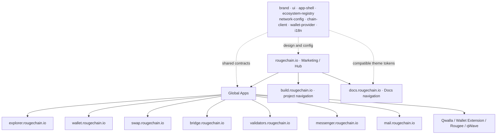

# Required production frontend architecture

The lead developer creates this in a separate repository. No empty production apps are to be added to this POC. Names may follow team conventions; boundaries are mandatory.

```text
rougechain-web/
  apps/
    marketing/ explorer/ wallet/ swap/ bridge/
    messenger/ mail/ validators/ build/
  packages/
    brand/ ui/ app-shell/ ecosystem-registry/
    chain-client/ wallet-provider/ network-config/ i18n/
  tooling/
```

Docs may retain its existing platform; do not require an apps/docs React runtime for symmetry. A standalone status app is conditional on the ownership decision.

Each app owns routing, product-specific state, build/deployment and failure boundaries. Shared packages provide canonical contracts and primitives, not one oversized runtime, cross-app mutable store or bundle containing every product. An Explorer outage must not require redeploying Marketing; an unrelated Mail release must not ship Swap code.



Build and Docs are deliberately outside the Apps taxonomy. External apps remain links, not new internal monorepo deployment obligations without a separate scope decision. Full workspace may remain `rougechain.io/workspace`.

## Three design modes

| Mode          | Priorities                                                        | Shared foundation                                           |
| ------------- | ----------------------------------------------------------------- | ----------------------------------------------------------- |
| Marketing     | Editorial, spacious, premium, narrative, restrained               | Brand, typography, spacing, controls, status, accessibility |
| Application   | Denser, task/data-oriented, precise, operational                  | Same tokens and semantics; shared dApp shell                |
| Documentation | Reading-first, technical, structured, code-friendly, high clarity | Same identity via tokens/theme; docs-specific navigation    |

Consistency does not require identical page layout or a common runtime. Every active surface migrates visually, including Docs and legal pages. See the complete [design matrix](DESIGN_MIGRATION_MATRIX.md).
